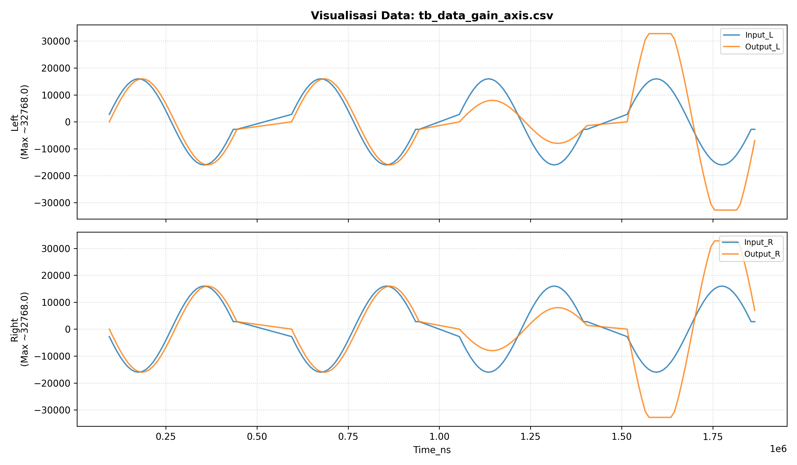
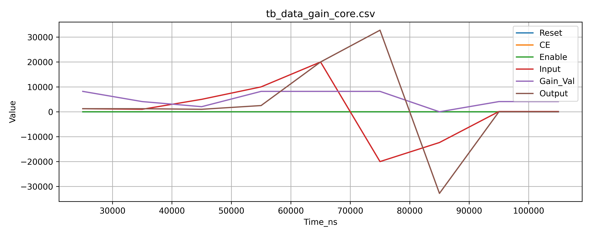

# Simulation Results – Gain Module

This folder contains **simulation artifacts** generated from SystemVerilog
testbenches for the Gain module.

The results are intended to:
- Validate functional correctness
- Illustrate fixed-point behavior
- Provide visual evidence of saturation, bypass, and enable logic

These plots are **not performance benchmarks** and are **not intended for
bit-exact audio evaluation**.

---

## 1. AXI-Stream Wrapper Test (`tb_data_gain_axis.csv`)

### Description

This result corresponds to the **system-level testbench**
(`tb_axis_gain_wrapper.sv`) and verifies the Gain module when integrated with:

- AXI4-Stream (audio data path)
- AXI4-Lite (control & gain registers)

### Signal Overview

| Signal     | Description |
|-----------|------------|
| Input_L   | Left-channel input stream |
| Input_R   | Right-channel input stream (phase-inverted for clarity) |
| Output_L  | Left-channel output after gain |
| Output_R  | Right-channel output after gain |

### Observations

- **Bypass mode**: Output follows input directly.
- **Unity gain (1.0)**: Output matches input amplitude.
- **Attenuation (0.5)**: Output amplitude is reduced proportionally.
- **Amplification (>1.0)**: Output increases until **signed 16-bit saturation**.
- Saturation behavior is symmetric and bounded at:
  - +32767
  - −32768

The phase relationship between channels is preserved.

> Note: Due to AXI-Stream pipelining, the plotted input and output samples are
> not cycle-aligned. This is acceptable for qualitative verification and
> waveform inspection.

---

## 2. Gain Core Unit Test (`tb_data_gain_core.csv`)

### Description

This result corresponds to the **core-level unit testbench**
(`tb_gain_core.sv`) and focuses on internal behavior without AXI interfaces.

### Signal Overview

| Signal    | Description |
|-----------|------------|
| Reset     | Active-low reset |
| CE        | Clock enable |
| Enable   | Gain enable (bypass when low) |
| Input    | Signed 16-bit PCM input |
| Gain_Val | Fixed-point gain (Q4.12) |
| Output   | Saturated signed 16-bit output |

### Observations

- **Clock Enable (CE)** correctly freezes output when deasserted.
- **Bypass mode** ignores gain value and forwards input.
- Fixed-point multiplication uses **Q4.12 scaling**.
- Saturation is applied **after scaling**, preventing overflow wraparound.
- Gain changes take effect deterministically on clock boundaries.

This testbench validates:
- Arithmetic correctness
- Control signal interaction
- Saturation logic integrity

---

## Notes on Fixed-Point Format

- Audio data: **signed 16-bit**
- Gain format: **Q4.12**
  - `1.0 = 4096`
  - `0.5 = 2048`
  - `2.0 = 8192`

Intermediate multiplication is widened before scaling and saturation.

---

## Scope & Limitations

- These simulations focus on **functional behavior**, not timing closure.
- No psychoacoustic or perceptual claims are made.
- Hardware validation was performed separately using **PYNQ overlay on Kria KV260**.

---

## Summary

The results confirm that the Gain module:
- Behaves deterministically
- Handles saturation safely
- Integrates correctly into an AXI-based audio pipeline
- Is suitable as a reusable DSP building block

The plots are provided as **supporting evidence**, not as a product showcase.
